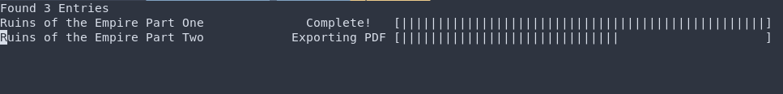

# RAD
Readallcomics.com downloading tool. automatically combines all pages into a PDF and tries to crop and rotate the pages nicely if neccessary.

## Usage

For this script you will need Python3 as well as an up-to-date version of PIP installed on your system.

After downloading, first install all dependencies by running

`$ pip install -r requirements.txt`

in the directory of the project. After that run the script a first time with `$ python3 RAD.py` and it will create a "links.txt" file.
This can then be filled with links to comics on readallcomics.com in the following format:

```
title  ; <link to readallcomics.com>
title that contains spaces  ;  <another link to readallcomics.com>
...
```

The amount of whitespaces around the ";" doesn't matter. The title and the link just need to be separated
by a semicolon.
After having put all the entries you need in the "links.txt" file you can run the script again just the same as before with

`$ python3 RAD.py`

(Depending on the number and length of the comics this could take a while)
After this you will be able to find the finished PDFs in the `./pdf/` directory and the single
pages of the comics as image files organized by title in the `./imgs/` directory.


### Example links.txt file

```
Ruins of the Empire Part One ; http://readallcomics.com/legend-of-korra-ruins-of-the-empire-part-01-2019/
Ruins of the Empire Part Two ; http://readallcomics.com/legend-of-korra-ruins-of-the-empire-part-02-2019/
Ruins of the Empire Part Three ; http://readallcomics.com/legend-of-korra-ruins-of-the-empire-part-03-2020/
```


### Example console output




#### Bonus: Additionally here the formatted content for links.txt to download all avatar comics:
https://pastebin.com/MJ6veNiP


(c) nighmared
